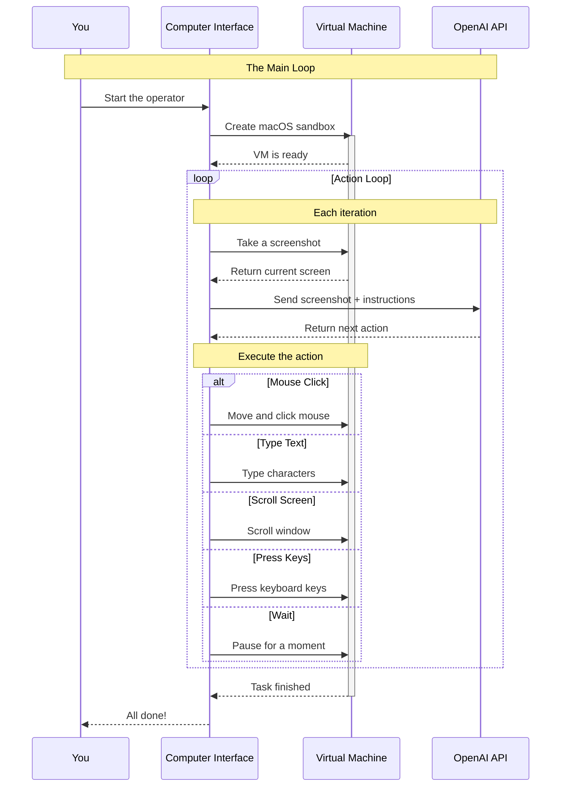

# Build Your Own Operator on macOS - Part 1

*Published on March 31, 2025 by Francesco Bonacci*

In this first blogpost, we'll learn how to build our own Computer-Use Operator using OpenAI's `computer-use-preview` model. But first, let's understand what some common terms mean:

- A **Virtual Machine (VM)** is like a computer within your computer - a safe, isolated environment where the AI can work without affecting your main system.
- **computer-use-preview** is OpenAI's specialized language model trained to understand and interact with computer interfaces through screenshots.
- A **Computer-Use Agent** is an AI agent that can control a computer just like a human would - clicking buttons, typing text, and interacting with applications.

Our Operator will run in an isolated macOS VM, by making use of our [cua-computer](https://github.com/trycua/cua/tree/main/libs/computer) package and [lume virtualization CLI](https://github.com/trycua/cua/tree/main/libs/lume).

Check out what it looks like to use your own Operator from a Gradio app:

<video width="100%" controls>
  <source src="/demo_gradio.mp4" type="video/mp4">
  Your browser does not support the video tag.
</video>

## What You'll Learn

By the end of this tutorial, you'll be able to:
- Set up a macOS virtual machine for AI automation
- Connect OpenAI's computer-use model to your VM
- Create a basic loop for the AI to interact with your VM
- Handle different types of computer actions (clicking, typing, etc.)
- Implement safety checks and error handling

**Prerequisites:**
- macOS Sonoma (14.0) or later
- 8GB RAM minimum (16GB recommended)
- OpenAI API access (Tier 3+)
- Basic Python knowledge
- Familiarity with terminal commands

**Estimated Time:** 45-60 minutes

## Introduction to Computer-Use Agents

Last March OpenAI released a fine-tuned version of GPT-4o, namely [CUA](https://openai.com/index/computer-using-agent/), introducing pixel-level vision capabilities with advanced reasoning through reinforcement learning. This fine-tuning enables the computer-use model to interpret screenshots and interact with graphical user interfaces on a pixel-level such as buttons, menus, and text fields - mimicking human interactions on a computer screen. It scores a remarkable 38.1% success rate on [OSWorld](https://os-world.github.io) - a benchmark for Computer-Use agents on Linux and Windows. This is the 2nd available model after Anthropic's [Claude 3.5 Sonnet](https://www.anthropic.com/news/3-5-models-and-computer-use) to support computer-use capabilities natively with no external models (e.g. accessory [SoM (Set-of-Mark)](https://arxiv.org/abs/2310.11441) and OCR runs).

Professor Ethan Mollick provides an excellent explanation of computer-use agents in this article: [When you give a Claude a mouse](https://www.oneusefulthing.org/p/when-you-give-a-claude-a-mouse).

### ChatGPT Operator
OpenAI's computer-use model powers [ChatGPT Operator](https://openai.com/index/introducing-operator), a Chromium-based interface exclusively available to ChatGPT Pro subscribers. Users leverage this functionality to automate web-based tasks such as online shopping, expense report submission, and booking reservations by interacting with websites in a human-like manner.

## Benefits of Custom Operators

### Why Build Your Own?
While OpenAI's Operator uses a controlled Chromium VM instance, there are scenarios where you may want to use your own VM with full desktop capabilities. Here are some examples:

- Automating native macOS apps like Finder, Xcode
- Managing files, changing settings, and running terminal commands 
- Testing desktop software and applications
- Creating workflows that combine web and desktop tasks
- Automating media editing in apps like Final Cut Pro and Blender

This gives you more control and flexibility to automate tasks beyond just web browsing, with full access to interact with native applications and system-level operations. Additionally, running your own VM locally provides better privacy for sensitive user files and delivers superior performance by leveraging your own hardware instead of renting expensive Cloud VMs.

## Access Requirements

### Model Availability
As we speak, the **computer-use-preview** model has limited availability:
- Only accessible to OpenAI tier 3+ users
- Additional application process may be required even for eligible users
- Cannot be used in the OpenAI Playground
- Outside of ChatGPT Operator, usage is restricted to the new **Responses API**

## Understanding the OpenAI API

### Responses API Overview
Let's start with the basics. In our case, we'll use OpenAI's Responses API to communicate with their computer-use model.

Think of it like this:
1. We send the model a screenshot of our VM and tell it what we want it to do
2. The model looks at the screenshot and decides what actions to take
3. It sends back instructions (like "click here" or "type this")
4. We execute those instructions in our VM

The [Responses API](https://platform.openai.com/docs/guides/responses) is OpenAI's newest way to interact with their AI models. It comes with several built-in tools:
- **Web search**: Let the AI search the internet
- **File search**: Help the AI find documents
- **Computer use**: Allow the AI to control a computer (what we'll be using)

As we speak, the computer-use model is only available through the Responses API.

### Responses API Examples
Let's look at some simple examples. We'll start with the traditional way of using OpenAI's API with Chat Completions, then show the new Responses API primitive.

Chat Completions:
```python
# The old way required managing conversation history manually
messages = [{"role": "user", "content": "Hello"}]
response = client.chat.completions.create(
    model="gpt-4",
    messages=messages  # We had to track all messages ourselves
)
messages.append(response.choices[0].message)  # Manual message tracking
```

Responses API:
```python
# Example 1: Simple web search
# The API handles all the complexity for us
response = client.responses.create(
    model="gpt-4",
    input=[{
        "role": "user", 
        "content": "What's the latest news about AI?"
    }],
    tools=[{
        "type": "web_search",  # Tell the API to use web search
        "search_query": "latest AI news"
    }]
)

# Example 2: File search
# Looking for specific documents becomes easy
response = client.responses.create(
    model="gpt-4",
    input=[{
        "role": "user", 
        "content": "Find documents about project X"
    }],
    tools=[{
        "type": "file_search",
        "query": "project X",
        "file_types": ["pdf", "docx"]  # Specify which file types to look for
    }]
)
```

### Computer-Use Model Setup
For our operator, we'll use the computer-use model. Here's how we set it up:

```python
# Set up the computer-use model to control our VM
response = client.responses.create(
    model="computer-use-preview",  # Special model for computer control
    tools=[{
        "type": "computer_use_preview",
        "display_width": 1024,     # Size of our VM screen
        "display_height": 768,
        "environment": "mac"       # Tell it we're using macOS.
    }],
    input=[
        {
            "role": "user", 
            "content": [
                # What we want the AI to do
                {"type": "input_text", "text": "Open Safari and go to google.com"},
                # Current screenshot of our VM
                {"type": "input_image", "image_url": f"data:image/png;base64,{screenshot_base64}"}
            ]
        }
    ],
    truncation="auto"  # Let OpenAI handle message length
)
```

### Understanding the Response
When we send a request, the API sends back a response that looks like this:

```json
"output": [
    {
        "type": "reasoning",           # The AI explains what it's thinking
        "id": "rs_67cc...",
        "summary": [
            {
                "type": "summary_text",
                "text": "Clicking on the browser address bar."
            }
        ]
    },
    {
        "type": "computer_call",       # The actual action to perform
        "id": "cu_67cc...",
        "call_id": "call_zw3...",
        "action": {
            "type": "click",           # What kind of action (click, type, etc.)
            "button": "left",          # Which mouse button to use
            "x": 156,                  # Where to click (coordinates)
            "y": 50
        },
        "pending_safety_checks": [],   # Any safety warnings to consider
        "status": "completed"          # Whether the action was successful
    }
]
```

Each response contains:
1. **Reasoning**: The AI's explanation of what it's doing
2. **Action**: The specific computer action to perform
3. **Safety Checks**: Any potential risks to review
4. **Status**: Whether everything worked as planned

## CUA-Computer Interface

### Architecture Overview
Let's break down the main components of our system and how they work together:

1. **The Virtual Machine (VM)**
   - Think of this as a safe playground for our AI
   - It's a complete macOS system running inside your computer
   - Anything the AI does stays inside this VM, keeping your main system safe
   - We use `lume` to create and manage this VM

2. **The Computer Interface (CUI)**
   - This is how we control the VM
   - It can move the mouse, type text, and take screenshots
   - Works like a remote control for the VM
   - Built using our `cua-computer` package

3. **The OpenAI Model**
   - This is the brain of our operator
   - It looks at screenshots of the VM
   - Decides what actions to take
   - Sends back instructions like "click here" or "type this"

Here's how they all work together:



The diagram above shows how information flows through our system:
1. You start the operator
2. The Computer Interface creates a virtual macOS
3. Then it enters a loop:
   - Take a picture of the VM screen
   - Send it to OpenAI with instructions
   - Get back an action to perform
   - Execute that action in the VM
   - Repeat until the task is done

This design keeps everything organized and safe. The AI can only interact with the VM through our controlled interface, and the VM keeps the AI's actions isolated from your main system.

---

## Implementation Guide

### Prerequisites

1. **Lume CLI Setup**
   For installing the standalone lume binary, run the following command from a terminal, or download the [latest pkg](https://github.com/trycua/cua/releases/latest/download/lume.pkg.tar.gz).

   ```bash
   sudo /bin/bash -c "$(curl -fsSL https://raw.githubusercontent.com/trycua/cua/main/libs/lume/scripts/install.sh)"
   ```

   **Important Storage Notes:**
   - Initial download requires 80GB of free space
   - After first run, space usage reduces to ~30GB due to macOS's sparse file system
   - VMs are stored in `~/.lume`
   - Cached images are stored in `~/.lume/cache`

   You can check your downloaded VM images anytime:
   ```bash
   lume ls
   ```

   Example output:

   | name                     | os      | cpu   | memory  | disk           | display   | status    | ip             | vnc                                               |
   |--------------------------|---------|-------|---------|----------------|-----------|-----------|----------------|---------------------------------------------------|
   | macos-sequoia-cua:latest | macOS   | 12    | 16.00G  | 64.5GB/80.0GB  | 1024x768  | running   | 192.168.64.78  | vnc://:kind-forest-zulu-island@127.0.0.1:56085    |

   After checking your available images, you can run the VM to ensure everything is working correctly:
   ```bash
   lume run macos-sequoia-cua:latest
   ```

2. **Python Environment Setup**
   **Note**: The `cua-computer` package requires Python 3.10 or later. We recommend creating a dedicated Python environment:

   **Using venv:**
   ```bash
   python -m venv cua-env
   source cua-env/bin/activate
   ```

   **Using conda:**
   ```bash
   conda create -n cua-env python=3.10
   conda activate cua-env
   ```

   Then install the required packages:

   ```bash
   pip install openai
   pip install cua-computer
   ```

   Ensure you have an OpenAI API key (set as an environment variable or in your OpenAI configuration).

### Building the Operator

#### Importing Required Modules
With the prerequisites installed and configured, we're ready to build our first operator.
The following example uses asynchronous Python (async/await). You can run it either in a VS Code Notebook or as a standalone Python script.

```python
import asyncio
import base64
import openai

from computer import Computer
```

#### Mapping API Actions to CUA Methods
The following helper function converts a `computer_call` action from the OpenAI Responses API into corresponding commands on the CUI interface. For example, if the API instructs a `click` action, we move the cursor and perform a left click on the lume VM Sandbox. We will use the computer interface to execute the actions.

```python
async def execute_action(computer, action):
    action_type = action.type
    
    if action_type == "click":
        x = action.x
        y = action.y
        button = action.button
        print(f"Executing click at ({x}, {y}) with button '{button}'")
        await computer.interface.move_cursor(x, y)
        if button == "right":
            await computer.interface.right_click()
        else:
            await computer.interface.left_click()
    
    elif action_type == "type":
        text = action.text
        print(f"Typing text: {text}")
        await computer.interface.type_text(text)
    
    elif action_type == "scroll":
        x = action.x
        y = action.y
        scroll_x = action.scroll_x
        scroll_y = action.scroll_y
        print(f"Scrolling at ({x}, {y}) with offsets (scroll_x={scroll_x}, scroll_y={scroll_y})")
        await computer.interface.move_cursor(x, y)
        await computer.interface.scroll(scroll_y)  # Using vertical scroll only
    
    elif action_type == "keypress":
        keys = action.keys
        for key in keys:
            print(f"Pressing key: {key}")
            # Map common key names to CUA equivalents
            if key.lower() == "enter":
                await computer.interface.press_key("return")
            elif key.lower() == "space":
                await computer.interface.press_key("space")
            else:
                await computer.interface.press_key(key)
    
    elif action_type == "wait":
        wait_time = action.time
        print(f"Waiting for {wait_time} seconds")
        await asyncio.sleep(wait_time)
    
    elif action_type == "screenshot":
        print("Taking screenshot")
        # This is handled automatically in the main loop, but we can take an extra one if requested
        screenshot = await computer.interface.screenshot()
        return screenshot
    
    else:
        print(f"Unrecognized action: {action_type}")
```

#### Implementing the Computer-Use Loop
This section defines a loop that:

1. Initializes the cua-computer instance (connecting to a macOS sandbox).
2. Captures a screenshot of the current state.
3. Sends the screenshot (with a user prompt) to the OpenAI Responses API using the `computer-use-preview` model.
4. Processes the returned `computer_call` action and executes it using our helper function.
5. Captures an updated screenshot after the action (this example runs one iteration, but you can wrap it in a loop).

For a full loop, you would repeat these steps until no further actions are returned.

```python
async def cua_openai_loop():
    # Initialize the lume computer instance (macOS sandbox)
    async with Computer(
        display="1024x768",
        memory="4GB",
        cpu="2",
        os_type="macos"
    ) as computer:
        await computer.run() # Start the lume VM
        
        # Capture the initial screenshot
        screenshot = await computer.interface.screenshot()
        screenshot_base64 = base64.b64encode(screenshot).decode('utf-8')

        # Initial request to start the loop
        response = openai.responses.create(
            model="computer-use-preview",
            tools=[{
                "type": "computer_use_preview",
                "display_width": 1024,
                "display_height": 768,
                "environment": "mac"
            }],
            input=[
                {  
                    "role": "user", 
                    "content": [
                        {"type": "input_text", "text": "Open Safari, download and install Cursor."},
                        {"type": "input_image", "image_url": f"data:image/png;base64,{screenshot_base64}"}
                    ]
                }
            ],
            truncation="auto"
        )

        # Continue the loop until no more computer_call actions
        while True:
            # Check for computer_call actions
            computer_calls = [item for item in response.output if item and item.type == "computer_call"]
            if not computer_calls:
                print("No more computer calls. Loop complete.")
                break

            # Get the first computer call
            call = computer_calls[0]
            last_call_id = call.call_id
            action = call.action
            print("Received action from OpenAI Responses API:", action)

            # Handle any pending safety checks
            if call.pending_safety_checks:
                print("Safety checks pending:", call.pending_safety_checks)
                # In a real implementation, you would want to get user confirmation here
                acknowledged_checks = call.pending_safety_checks
            else:
                acknowledged_checks = []

            # Execute the action
            await execute_action(computer, action)
            await asyncio.sleep(1)  # Allow time for changes to take effect

            # Capture new screenshot after action
            new_screenshot = await computer.interface.screenshot()
            new_screenshot_base64 = base64.b64encode(new_screenshot).decode('utf-8')

            # Send the screenshot back as computer_call_output
            response = openai.responses.create(
                model="computer-use-preview",
                tools=[{
                    "type": "computer_use_preview",
                    "display_width": 1024,
                    "display_height": 768,
                    "environment": "mac"
                }],
                input=[{  
                    "type": "computer_call_output",
                    "call_id": last_call_id,
                    "acknowledged_safety_checks": acknowledged_checks,
                    "output": {
                        "type": "input_image",
                        "image_url": f"data:image/png;base64,{new_screenshot_base64}"
                    }
                }],
                truncation="auto"
            )

        # End the session
        await computer.stop()

# Run the loop
if __name__ == "__main__":
    asyncio.run(cua_openai_loop())
```

You can find the full code in our [notebook](https://github.com/trycua/cua/blob/main/notebooks/blog/build-your-own-operator-on-macos-1.ipynb).

#### Request Handling Differences
The first request to the OpenAI Responses API is special in that it includes the initial screenshot and prompt. Subsequent requests are handled differently, using the `computer_call_output` type to provide feedback on the executed action.

##### Initial Request Format
- We use `role: "user"` with `content` that contains both `input_text` (the prompt) and `input_image` (the screenshot)

##### Subsequent Request Format
- We use `type: "computer_call_output"` instead of the user role
- We include the `call_id` to link the output to the specific previous action that was executed
- We provide any `acknowledged_safety_checks` that were approved
- We include the new screenshot in the `output` field

This structured approach allows the API to maintain context and continuity throughout the interaction session.

**Note**: For multi-turn conversations, you should include the `previous_response_id` in your initial requests when starting a new conversation with prior context. However, when using `computer_call_output` for action feedback, you don't need to explicitly manage the conversation history - OpenAI's API automatically tracks the context using the `call_id`. The `previous_response_id` is primarily important when the user provides additional instructions or when starting a new request that should continue from a previous session.

## Conclusion

### Summary
This blogpost demonstrates a single iteration of a OpenAI Computer-Use loop where:

- A macOS sandbox is controlled using the CUA interface.
- A screenshot and prompt are sent to the OpenAI Responses API.
- The returned action (e.g. a click or type command) is executed via the CUI interface.

In a production setting, you would wrap the action-response cycle in a loop, handling multiple actions and safety checks as needed.

### Next Steps
In the next blogpost, we'll introduce our Agent framework which abstracts away all these tedious implementation steps. This framework provides a higher-level API that handles the interaction loop between OpenAI's computer-use model and the macOS sandbox, allowing you to focus on building sophisticated applications rather than managing the low-level details we've explored here. Can't wait? Check out the [cua-agent](https://github.com/trycua/cua/tree/main/libs/agent) package!

### Resources
- [OpenAI Computer-Use docs](https://platform.openai.com/docs/guides/tools-computer-use)
- [cua-computer](https://github.com/trycua/cua/tree/main/libs/computer)
- [lume](https://github.com/trycua/cua/tree/main/libs/lume)