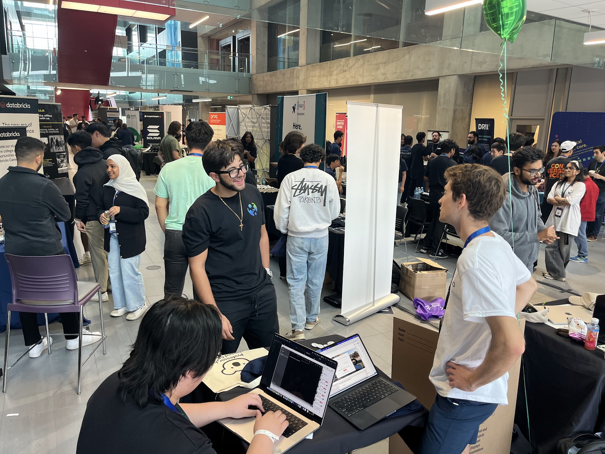
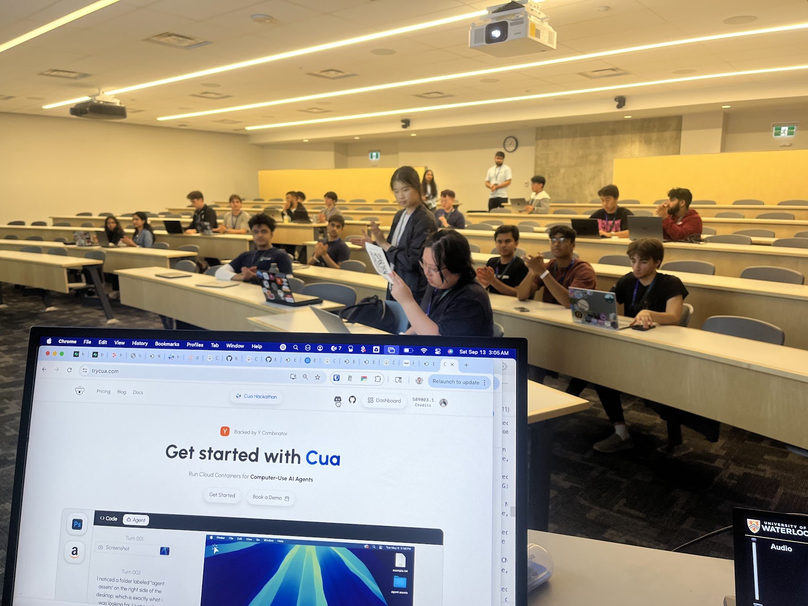
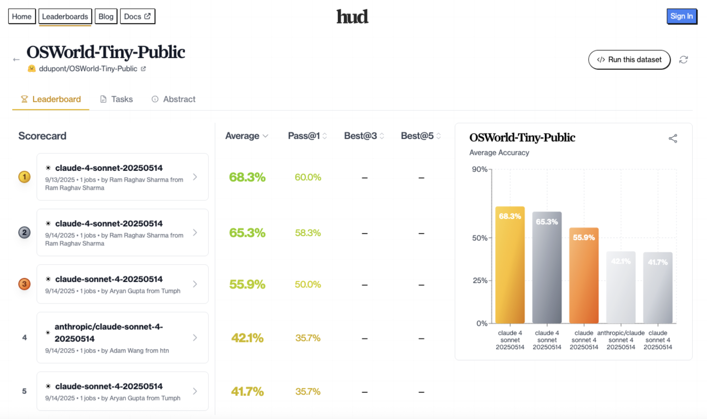
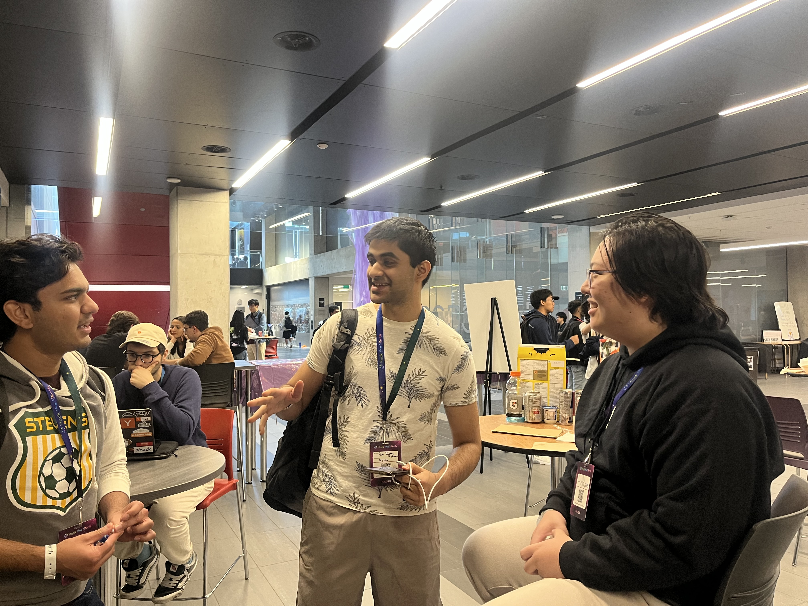
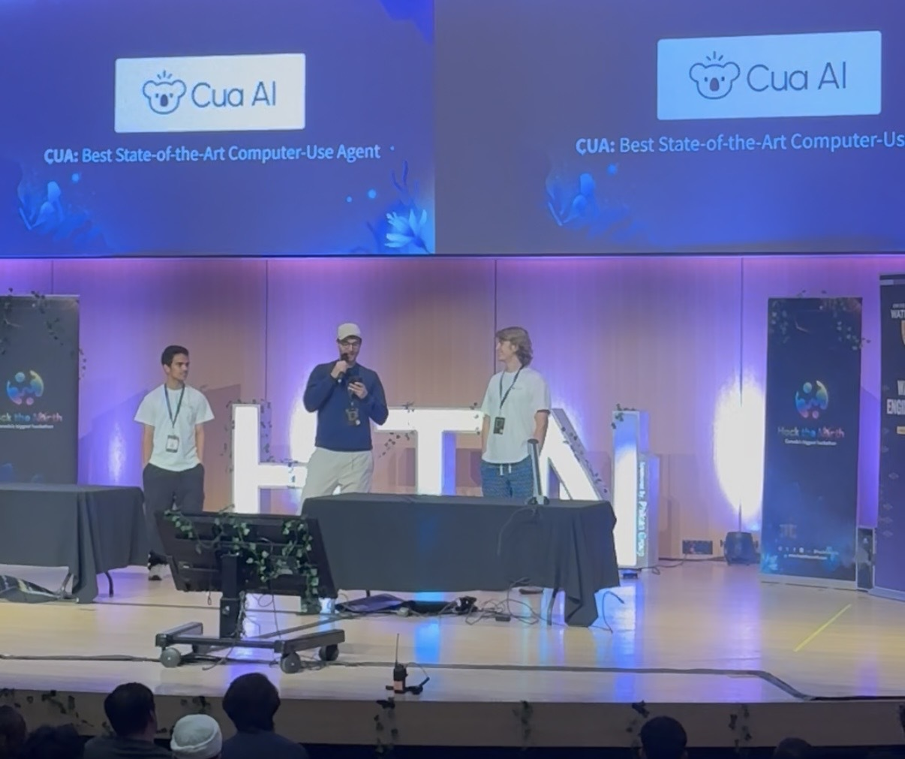

# What happens when hackathon judging is a public benchmark (Hack the North edition)

_Written by Francesco Bonacci — Reviewed by Parth Patel (HUD W25) — Sept 25, 2025_

## Prologue

Hack the North ran Sept 12–14 at the University of Waterloo. Official count this year: **1,778 hackers**, and a [Guinness World Record for the most people building interlocking plastic brick sculptures simultaneously](https://uwaterloo.ca/news/eweal-making-hackathons-fun-again-breaking-guinness-world-record).

Our team arrived from Europe and the US one day before the hackathon, after a summer scattered post–YC X25, waiting for our O-1 visas. **HUD**’s founders Parth and Jay flew in from SF to help us run evaluations, and Michael and Parth from **Ollama** joined as co-sponsors.

Our plan was ambitious: run the **first state-of-the-art Computer-Use Agents track**, score it on a public benchmark, and give the top performer a guaranteed YC interview. (Interview ≠ offer. YC didn’t judge.)

The rest, as they say, was a 36h story worth telling—and a playbook worth sharing for anyone thinking about running or sponsoring this type of hackathon track.

## The sign-up problem we had to invent

We joined as a sponsor at the last minute, thanks to a push from our friend @Michael Chiang at Ollama—Waterloo alum, naturally. It’s kind of an open secret that UWaterloo turns out some of the sharpest hackers around (_no pun intended, HackMIT_). It was a bit of a scramble, but also great timing—our Agent framework had just finished a major refactor, with support for **100+ VLM configurations** now live. Naturally, we wanted to stress-test it at scale—and see whether teams could come up with SOTA-level setups. _This wasn’t a blank-slate, build-whatever-you-want kind of track._

From day one, though, we knew we’d have to fight for sign-ups. This was a niche track, and a guaranteed YC interview alone wouldn’t be enough to pull people in.

Unfortunately, Hack the North (HTN) didn’t offer an interest form to help us estimate demand, which made capacity planning tricky—especially with early-stage infra. Stress-testing takes foresight, and multimodal language model usage is still costly (~1.5× to 3–4× the price of comparable text-only models).

On top of that, we were discouraged from external promotion on [lu.ma](http://lu.ma). So we spun up our own sign-up page at **trycua.com/hackathon** and built ad-hoc Discord channels to share track details. We emphasized—repeatedly—that only students already accepted to Hack the North should register.

_(Moral: the “measure-zero effect”—no matter how many times you say it, some people won’t see it. Plenty of invalid sign-ups still slipped through.)_

Even so, having your own form is absolutely worth it: it gives you an **early funnel**, surfaces demand signals ahead of time, and—crucially—**lets you require platform sign-up before kickoff**. In our case, Hack the North didn’t provide Devpost access until the very end, so our form was the only way to build a working roster.

Only a small trickle of sign-ups came through by the time the event kicked off—too few to plan around, but clearly the right kind of crowd. Several were already familiar with computer-use agents; one was even interning at Shopify, working on this space.

## At the Sponsor Booth

Day 0 on campus made the difference. We arrived a couple of hours early to collect swag shipments (around 1,200 stickers of our new **Cua-la** mascot, plus t-shirts and hats—always plan ~1.5× the estimated number of hackers!). After walking the sponsor floor and explaining the track at our booth, ~40 hackers signed up.

**Moral:** sponsor booths are still the most effective way to recruit for a track.

**Suggestions to maximize booth time (for HTN this is only ~24 of the total 36 hours):**

- **Be unmistakable.** Run a mini-challenge and a visible giveaway. We offered 5 × $200 Anthropic credits as a lightning raffle and constantly advertised in HTN Slack. Shout-out to our neighbors at **Mintlify**, who dressed their teammate as a mint plant - memorable and effective.
- **Create multiple touchpoints.** Hand out flyers and QR codes, and ask nearby booths to cross-refer. Big thanks to the YC team for flyer space and student connections - and to Michael (Ollama) for pointing visitors our way.
- **Never leave the booth empty.** Keep someone at the booth at all times and rotate shifts. With four founding engineers on-site, coverage was easy. Even after hacking kicked off, the booth stayed a point of reference - and even then multiple participants DM’d us asking where to meet up.
- **Students are organic DevRel.** Our runner-up, Adam, hung out with us at the booth, pulling more people in. Peer-to-peer energy creates the network effect you need!

_(Our Founding Engineer, Morgan, hangs out with students at the stand, while Adam (runner-up) hacks on the side.)_

## 02:30 a.m. is still prime time at a hackathon

Hack the North gives sponsors a 30-minute API Workshop during the early hours of the event—a perfect moment to shift from talking to building.

Our slot landed at **2:30 a.m.** (_perks of the cheapest sponsor tier_). Thirty students showed up, energy surprisingly high. James, our new Founding DevRel Engineer, led the session and nailed it.

**Our track rules were simple:**

1. Build a Computer-Use Agent with the [Cua framework](https://github.com/trycua/cua)
2. Benchmark the agent on [HUD](https://www.hud.so)
3. Use [OSWorld-Tiny](https://huggingface.co/datasets/ddupont/OSWorld-Tiny-Public): a 14-task distillation of the full benchmark (~360 tasks, >1h)

**Suggestions:**

- **Leave something tangible.** We provided a Jupyter Notebook teams could run immediately.
- **Narrow scope, strong starts.** The more focused the challenge, the more **robust starting points** you should provide.
- **Want the details?** [Here’s the notebook we left participants](https://github.com/trycua/cua/blob/main/notebooks/sota_hackathon.ipynb).

_(Our CUA Workshop at 2:30 AM.)_

## Making it possible to focus on the work

If you’re an OSS framework, it’s tempting to have hackers self-host on laptops. **Don’t.** You’ll spend the workshop debugging setups instead of reviewing ideas.

**Lesson learned:** within hours, we shifted to **cloud-only Sandboxes**. Payoff: consistent environments, faster starts, far less tech support.

We provided:

- **Credits:** $200 Cua Cloud + $200 HUD per team (manual top-ups for visible progress)
- **LLMs/VLMs:** Anthropic assigned $50 per participant—tight for VLM iteration—so we added capped access under our org
- **Pre-kickoff provisioning:** Platform sign-up auto-created projects, keys, and sandboxes

**Takeaway:** every minute not spent on setup is a minute gained for iterating.

## 12 Hours in the Hackathon

**After the workshop buzz.** Morning interest was high, but Docker setup + requiring focus on a single track thinned the crowd. Most sponsor prizes are broad (“use our product and you qualify”), letting students stack tracks. Ours required commitment. Upside: those who stayed shipped sharper, higher-quality submissions.

**The bell curve of submissions.** Most entries used _claude-sonnet-4-20250514_—proof that docs and public leaderboards ([OSWorld](https://os-world.github.io/#benchmark)) guide choices. Results clustered around the safe pick, with fewer pushing boundaries.

**Who went beyond the baseline.** A few tried multi-agent/tool graphs. One standout—[**cuala**](https://github.com/YeIIcw/cuala)—was a clean reference: deterministic actions, verifiable state changes, callbacks for saving images and trajectories.

**Bottom line:** Early excitement is easy; keeping teams engaged requires reducing friction and offering multiple entry points.

### What broke (and why)

We skipped a full end-to-end **Cua × HUD** dry-run. It showed.

- Hackers ran out of inference credits. Desktop tasks are token-heavy. A full OSWorld run (200 max steps) for _computer-use-preview_ (OpenAI Operator API) can cost >$600. Serious attempts: ~400k tokens × 14 tasks.
- Python version/build mismatches surfaced, requiring debug time across both OSS repos.
- Our Cua framework lacked a **Response Agent** to complete evaluation loops. Some runs stalled until patched.

## Scoring and Results

### Participation & Outcomes

- ~**30** hackers gave the track a serious try; **5** crossed the finish line
- All submissions were **solo**, mostly undergrads
- Judging: OSWorld-Tiny on HUD, with Cua + HUD reruns to verify scores
- Final leaderboard: [HUD Leaderboard](https://www.hud.so/leaderboards/ddupont/OSWorld-Tiny-Public)

_(Leaderboard on HUD)_

### Winners

**🥇 Winner — Ram**

- Devpost: https://devpost.com/software/sota-computer-use-agent-challenge
- Code: https://github.com/Ram-Raghav-S/cua/tree/ram
- Score: 68.3%

**🥈 Runner-up — Aryan**

- Devpost: https://devpost.com/software/loopdeloop-computer-use-agent-sota-attempt
- Code: https://github.com/Tumph/cua
- Score: 55.9%

**🥉 Special Mention — Adam**

- Devpost: https://devpost.com/software/cuala
- Code: https://github.com/YeIIcw/cuala
- Score: 42.1%

_(Our finalists before the award ceremony)_

## What We’d Keep

- **Sponsor Hack the North again**
- **Keep a visible, staffed booth**
- **Publish a compact FAQ**
- **Simple, transparent scoring**

## What We’d Change

- **Run a full Cua × HUD dry-run under load**
- **Offer multiple on-ramps (evals, creative, RL)**
- **Keep a private eval set for judging**
- **Default to cloud sandboxes**
- **Handle ops earlier (swag, signage, QR codes)**
- **Reward generalization, not lucky runs**

## Closing Thoughts

Our first outing as sponsors wasn’t perfect, but it gave us a working playbook: **provision cloud early, keep scoring simple, always dry-run infra, and make the booth unforgettable**.

If more hackathon tracks leaned on **public benchmarks**, weekends like this would produce fewer demos-for-show and more measurable progress.

**P.S.** Huge thanks to the Ollama and HUD teams for co-sponsoring the track, and to our YC Partner Diana for offering a **guaranteed YC interview** as first prize.

Whether you’re a hacker who wants to participate, or a company looking to sponsor, let’s talk — we’re especially excited to support benchmark-first hackathon tracks in the Bay Area this year.

_(HTN Closing Ceremony — Cua Track Winner Announcement)_
